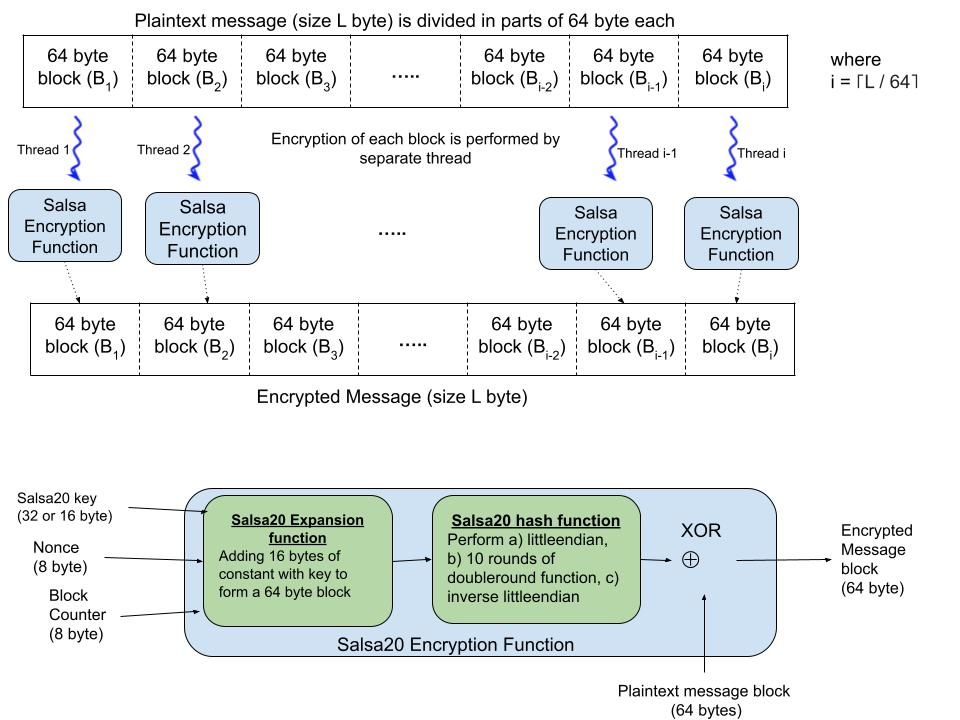

# Implementation of Salsa20 Stream Cipher in C

## Introduction: 
In this project we implemented the [Salsa20 Stream Cipher](https://www.ecrypt.eu.org/stream/e2-salsa20.html) in C. We also added parallel exectution of the algorithm using threads. We are using the POSIX Thread C Library `pthread.h` in this implementation.

## Execution:
1. To complile the C program: `gcc salsa20.c -lpthread -o salsa20`
2. To run the C program: `./salsa20 <input_file_name> <output_file_name>`
   If no input/ output file name is specified, `salsa_input.txt` and `salsa_output.txt` will be taken by default.
3. The result of the algorithm is stored in the output file specified in step 2.
4. You can use that result text to encrypt/ decrypt it again following the step 1 and 2.
5. To decrypt the encrypted text use encrypted values in ASCII format as input and follow step 4 to get original plaintext.

## How Parallel Execution Works:
We split the input text/ message into bunch of smaller message blocks each of 64 bytes in sequencial order. That means, we take each 64 byte message and do the encryption/ decryption using a seperate threads. Each thread exectutes independently and computes the encrypted/ decrypted text for the corresponding 64 byte input text.

